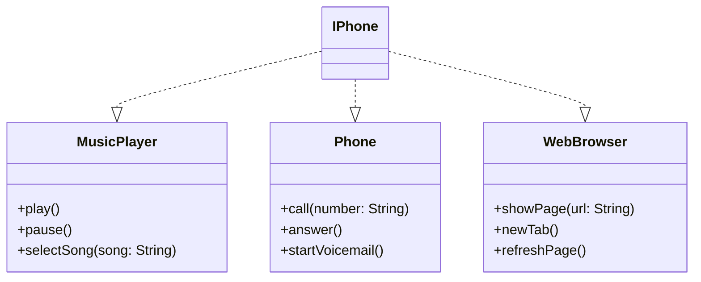

# Componente iPhone – Desafio POO (DIO)

Implementação de um componente iPhone utilizando Programação Orientada a Objetos (POO) e UML.  
O iPhone agrega três funcionalidades principais por meio de interfaces:

- **MusicPlayer**: `play`, `pause`, `selectSong`
- **Phone**: `call`, `answer`, `startVoicemail`
- **WebBrowser**: `showPage`, `newTab`, `refreshPage`

A classe concreta **IPhone** implementa todas as três interfaces.

---

## UML


## Estrutura de arquivos
```
├── MusicPlayer.java
├── Phone.java
├── WebBrowser.java
├── IPhone.java
└── Main.java
```
## Como compilar e executar
```
javac *.java
java Main
```
## Saída esperada
```
Selected song: Imagine - John Lennon
Playing song on iPhone.
Song paused.
Calling: +55 51 99999-9999
Answering call...
Starting voicemail.
Showing page: https://www.google.com
New browser tab opened.
Page refreshed.
```


